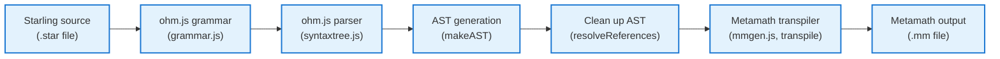
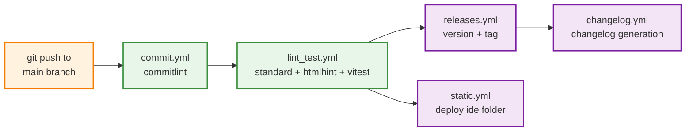

# Architecture

This document is a work in progress! Feel free to [contribute](CONTRIBUTING.md) better explanations or visualizations.

## Compilation
This diagram describes how Starling gets compiled into Metamath.

## Continuous Integration
This diagram describes the continous integration workflow for this repository.

