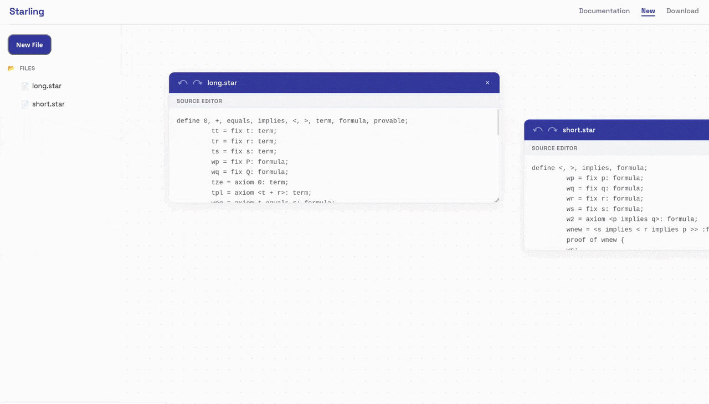

# ⭐Starling

## Starling is a proof assistant that makes interactive theorem proving accessible.



  


## ⭐Try Starling Now
No installation needed! **[Open the web editor](https://starling-lang.org/editor)** and write your first proof in minutes.


## ⭐Quick Start

In your terminal:

```bash
git clone https://github.com/starlinglang/starling.git
cd starling/ide
npx http-server
```

## ⭐Features

| Feature | Benefit |
|---------|---------|
| **Metamath Foundation** | Mathematical proofs verified rigorously |
| **Human-Readable Syntax** | Inspired by Isabelle/Isar, so proofs read like math |
| **Infinite Canvas** | Write proofs the way you think|
| **Undo/Redo + Export** | Explore ideas without fear or hesitation; save and share your work |

## ⭐Why Starling?

The learning curve for existing proof assistants is steep, and the error messages given are not always helpful. 

Starling is a rigorous proof assistant which is friendly to mathematicians and students at the beginning of their coding journey.


## ⭐Contributing

Contributions are welcome. The build system for this project is simple:

```bash
git clone https://github.com/starlinglang/starling.git
cd starling/lang
npm install
npm run build
```

If you want to contribute, you might consider working on features in the Starling roadmap such as:

* Metamath to Starling compilation
* [Pantograph integration](https://arxiv.org/pdf/2411.16571)
* [Proof visualization](https://github.com/Paper-Proof/paperproof)
* [Theorem provenance visualization](https://github.com/patrik-cihal/lean-graph) 
* Quickcheck tests
* Theorem counterexample generation 
* Proof imports from other languages
* [Error messages](https://dl.acm.org/doi/10.1145/3344429.3372508)
* [Interactive language documentation](https://willcrichton.net/nota)
* Remote collaboration
